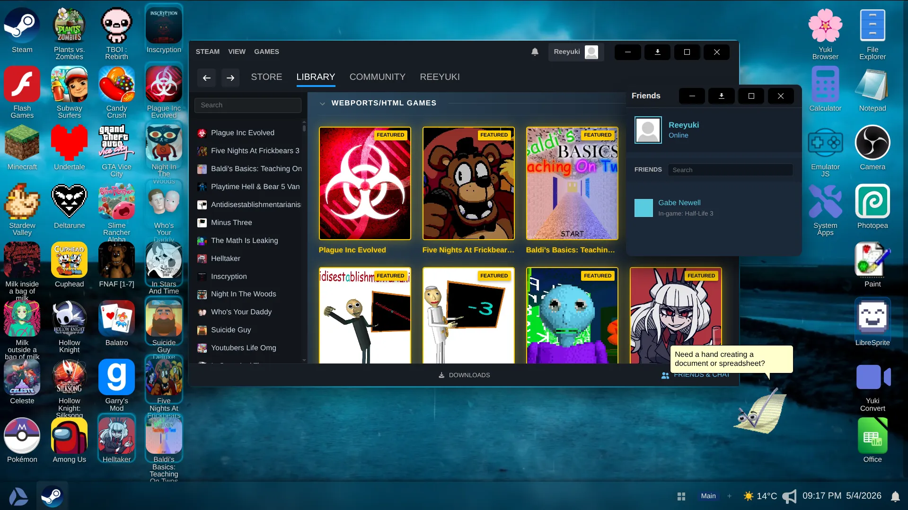
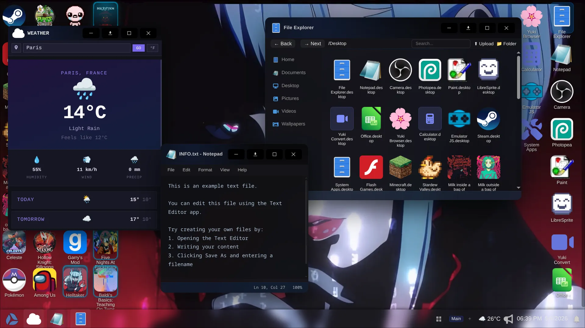
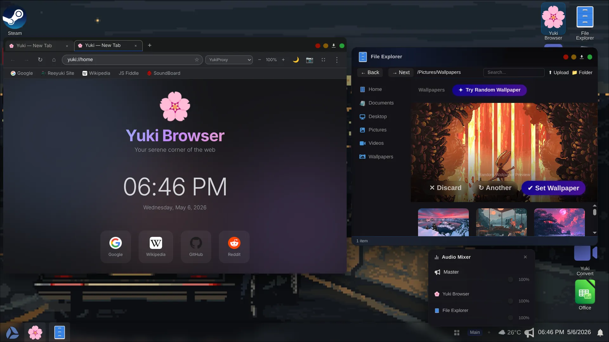
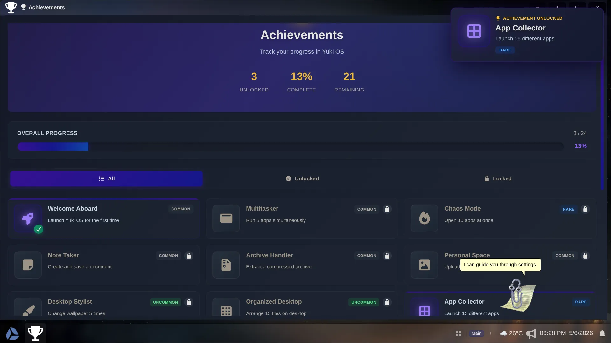

# Yuki OS — Browser-Based Desktop Environment

https://discord.gg/uFuGfseB9Z

> A webOS-style desktop environment running in the browser, featuring 30+ applications, 2700+ games, multiple emulators, and a service-oriented architecture for seamless multitasking.

Yuki OS is a fully-featured browser-based operating system that unifies games, emulators, productivity tools, and web applications into a single windowed desktop experience. Run Flash games, DOS emulation, modern web apps, and custom applications all side-by-side with a shared window manager, filesystem, and UI.







---

## ✨ Key Features

### Desktop Environment
- **Windowed multitasking** — Drag, resize, snap, minimize, maximize windows
- **Virtual filesystem** — BrowserFS-backed persistent storage (IndexedDB)
- **Start menu & taskbar** — Launch apps, view running windows, manage focus
- **Desktop icons** — Shortcut organization with auto-refresh
- **Wallpapers & themes** — 13 built-in + custom wallpaper support
- **User profiles** — Custom username, profile picture, desktop colors

### Application System
- **30+ built-in apps** — File explorer, terminal, editor, settings, media players, utilities
- **2700+ games** — Browser games, emulated classics, Flash content via Ruffle
- **Service-oriented architecture** — WindowManager, FileSystemManager, NotificationCenter, EventBus
- **Modular & extensible** — Add new apps without modifying core
- **Dependency injection** — Clean service access, loose coupling

### Multi-Runtime Support
- **Ruffle Flash emulation** — Play .swf files
- **JS-DOS** — DOS games with full emulation
- **V86** — Full x86-64 system emulation (Linux, Windows, FreeBSD)
- **WebAssembly** — Native web apps
- **HTML5 games** — Canvas, WebGL content
- **iframes & sandboxing** — Secure app isolation

### System Features
- **Notifications** — Toast popups with Do-Not-Disturb mode
- **File operations** — Create, read, write, organize files and directories
- **Settings** — Persistent preferences (theme, wallpaper, volume)
- **Achievements** — Track app launches, playtime milestones
- **Analytics** — Usage statistics and event tracking
- **Audio mixer** — Per-app volume control with master volume
- **CORS proxy** — Access restricted content via proxy configuration

---

## 🚀 Quick Start

### For Users

1. **Open in browser** — Single-file HTML deployment
2. **Explore apps** — Click Start Menu, browse 30+ applications
3. **Create shortcuts** — Use App Creator to add custom apps
4. **Manage files** — Use Explorer to organize filesystem
5. **Customize** — Change theme, wallpaper, and preferences in Settings

### For Developers

**Prerequisites:**
```bash
Node.js 16+ and npm/pnpm
```

**Setup:**
```bash
cd webos-desktop
npm install
npm run dev          # Start dev server with HMR
npm run build        # Compile to single HTML file
npm run preview      # Test production build
```

**Output:**
- Development: `http://localhost:5173`
- Production: `dist/index.html` (single file, all assets inlined)

---

## 📁 Project Structure

```
yukios/
├── README.md                   (this file)
├── AGENTS.md                   (architecture & agent reference)
├── package.json
│
├── webos-desktop/              (main application)
│   ├── src/
│   │   ├── main.js            (entry point, services initialization)
│   │   ├── app.js             (app container)
│   │   ├── desktop.js         (desktop element)
│   │   │
│   │   ├── windowManager.js    (window lifecycle & z-ordering)
│   │   ├── fs.js              (BrowserFS virtual filesystem)
│   │   ├── notificationCenter.js (toast notifications)
│   │   ├── core/EventBus.js   (pub-sub event system)
│   │   │
│   │   ├── appLauncher.js      (central app dispatcher)
│   │   ├── gamesList.js        (2700+ game registry)
│   │   ├── gameDescriptions.js (game metadata)
│   │   │
│   │   ├── explorer.js         (file manager)
│   │   ├── fileDisplay.js      (file rendering)
│   │   ├── archiveExtractor.js (ZIP/7z support)
│   │   │
│   │   ├── appCreator.js       (custom app shortcuts)
│   │   ├── games.js            (game launcher UI)
│   │   ├── jsdos.js            (DOS emulator)
│   │   ├── v86.js              (x86 emulator)
│   │   │
│   │   ├── (20+ more app modules)
│   │   │
│   │   ├── settings.js         (preference storage)
│   │   ├── system.js           (wallpaper/theme)
│   │   ├── wallpapers.js       (wallpaper store)
│   │   ├── audioMixer.js       (audio control)
│   │   │
│   │   ├── desktopui.js        (desktop & taskbar UI)
│   │   ├── startMenu.js        (start menu)
│   │   └── shared/             (utilities)
│   │
│   ├── public/
│   │   ├── manifest.webmanifest (PWA config)
│   │   ├── sw.js              (service worker)
│   │   └── icons/
│   │
│   ├── vite.config.js          (single-file bundle config)
│   └── package.json
│
├── static/                      (CDN assets)
│   ├── wallpapers/
│   ├── games/
│   ├── icons/
│   └── apps/
│
└── desktop/                     (compiled output)
    └── index.html              (production build)
```

---

## 🏗️ Architecture Overview

Yuki OS uses **service-oriented, event-driven architecture**:

```
Services Container
├── WindowManager       — Window lifecycle, dragging, z-ordering
├── FileSystemManager   — Virtual filesystem operations
├── NotificationCenter  — Desktop notifications
└── EventBus           — Global pub-sub events

↓ (dependency injection)

30+ Applications (all inherit BaseApp)
├── System Apps (Explorer, Terminal, Settings, etc.)
├── Game Launchers (AppLauncher, games.js)
├── Emulators (JsDosApp, V86App)
├── Productivity (Notepad, Monaco, Calculator)
└── Utilities (Music, Camera, News, Weather, etc.)

↓ (renders)

Desktop UI
├── Desktop background & icons
├── Taskbar
├── Start menu
└── Window chrome
```

**Key Pattern:** All applications receive services in constructor:

```javascript
class MyApp extends BaseApp {
  constructor(services) {
    this.services = services;
  }
  
  open() {
    const win = this.services.windowManager.createWindow(...);
    this.services.fileSystem.readFile(...);
    this.services.notificationCenter.notify(...);
    this.services.eventBus.on('SETTINGS_CHANGED', handler);
  }
}
```

---

## 🛠️ Adding a New Application

**5-step process:**

1. **Create app class** (inherit BaseApp, implement `open()` and `onClose()`)
2. **Register in main.js** (instantiate and add to services)
3. **Add metadata to gamesList.js** (title, icon, action)
4. **Implement lifecycle hooks** (window creation, cleanup)
5. **Use injected services** (file I/O, notifications, events)

For detailed steps, see [AGENTS.md — How to Add a New Application](AGENTS.md#how-to-add-a-new-application)

---

## 📦 Built-in Applications

### System Tools (10+)
- **Explorer** — File manager with thumbnails and drag-drop
- **Terminal** — CLI shell with commands (ls, cd, mkdir, rm, etc.)
- **Notepad** — Text editor with save/load
- **Markdown Editor** — Live preview markdown
- **Monaco** — VS Code-powered code editor
- **Calculator** — Scientific calculator
- **Settings** — User preferences and configuration
- **Task Manager** — Window monitoring and control
- **Terminal** — Shell interface
- **About** — System information

### Emulators & Games (20+)
- **Steam Game Launcher** — Browse 2700+ games
- **JS-DOS** — DOS game emulation with Ruffle Flash
- **V86** — Full x86-64 system emulation
- **Categories** — Game organization by genre
- Flash games via Ruffle

### Media & Utilities (10+)
- **Music Player** — Audio playback with playlists
- **Camera** — Webcam capture
- **3D Viewer** — Three.js for OBJ/GLTF models
- **YouTube** — Video integration
- **Browser** — Lightweight web browser
- **News** — News aggregation
- **Weather** — Weather forecasting
- **Office Viewer** — DOCX/XLSX/PPTX support
- **Archive Extractor** — ZIP/7z extraction
- **App Creator** — Custom app shortcuts

---

## 🔧 Build & Deployment

### Build Process

```bash
npm run build     # Single-file bundle
npm run format    # Prettier code formatting
npm run lint      # ESLint with auto-fix
```

### Output

Single HTML file with all assets inlined:
- JavaScript minified
- CSS inlined
- Images as base64
- No external dependencies (except CDN game content)

### Deployment

Serve `dist/index.html` from:
- Root: `https://example.com/`
- Subdirectory: `https://example.com/desktop/`

**Tech Stack:**
- **Vite 7.3.1** — Fast build tool
- **viteSingleFile** — Single-file bundling
- **BrowserFS** — Virtual filesystem
- **IndexedDB** — Persistent storage
- **interactjs** — Window dragging/resizing
- **Ruffle** — Flash emulation
- **Monaco** — Code editor
- **Three.js** — 3D rendering
- **fflate** — Compression (ZIP/deflate)

---

## 📚 Documentation

- **[AGENTS.md](AGENTS.md)** — Complete architecture reference, all services and agents, integration guide
- **Source files** — Each module is self-documented with clear structure

---

## 🎮 Playing Games

### Browse Games
1. Open Start Menu
2. Click "Games" or "Categories"
3. Browse by genre or search
4. Click to launch

### Adding Custom Games
1. Open **App Creator**
2. Enter game URL
3. Optional: Configure CORS proxy
4. Save to Apps folder
5. Access from Explorer or Start Menu

### Supported Formats
- HTML5 games
- Flash games (via Ruffle)
- DOS games (via JS-DOS)
- GBA, NDS, SNES ROMs (via emulators)
- WebAssembly applications

---

## 💾 File System

Virtual filesystem mounted at `/home/reeyuki/`:

```
/home/reeyuki/
├── Desktop/              (desktop icons)
├── Documents/
│   └── INFO.txt
├── Pictures/
│   └── Wallpapers/       (13 default + custom)
└── Apps/                 (user-created apps)
```

All files persist in IndexedDB between sessions.

---

## 🔗 Content Delivery

**CDN Bases:**
- Main assets: `https://cdn.statically.io/gh/reeyuki/yukios@a3efea2218a5d717290e72ea41cd341d14689ce5`
- Games: `https://cdn.statically.io/gh/reeyuki/yukios-games@main`

**CORS Proxy:** Apps support proxy configuration for accessing restricted content.

---

## 🚦 Development Workflow

```bash
npm run dev        # Start dev server, watch for changes
                   # http://localhost:5173

npm run build      # Compile to production
                   # Output: dist/index.html

npm run preview    # Test production build locally

npm run format     # Format code with Prettier

npm run lint       # Check and fix ESLint issues
```

---

## 🤝 Contributing

To extend Yuki OS:

1. **Add a new app** — Follow the 5-step process in [AGENTS.md](AGENTS.md)
2. **Modify a service** — Update WindowManager, FileSystemManager, etc.
3. **Add games** — Update gamesList.js and CDN links
4. **Fix bugs** — Submit issues and PRs
5. **Improve docs** — Keep AGENTS.md and README current

---

## 📋 Project Metadata

- **Framework** — Vanilla JavaScript (ES modules)
- **Package Manager** — pnpm
- **Build Tool** — Vite 7.3.1
- **Node Version** — 16+
- **Browser Support** — Modern browsers (ES Next)

---

## 📜 License

Platform code is licensed under the project license.

External components remain under their respective licenses:
- Ruffle (Flash emulation)
- JS-DOS (DOS emulator)
- V86 (x86 emulation)
- Monaco (VS Code editor)
- Three.js (3D rendering)
- Game assets and ROMs (their original owners)

---

## 🌟 Highlights

- **Single-file deployment** — All code and assets in one HTML file
- **No build complexity** — Vite handles all bundling automatically
- **Progressive Web App** — Works offline with service worker
- **Persistent storage** — IndexedDB-backed filesystem
- **Sandboxed execution** — Games and apps run in isolated iframes
- **Extensible architecture** — Add apps without core changes

---

**Ready to explore?** Start with [AGENTS.md](AGENTS.md) for detailed architecture and integration patterns.
