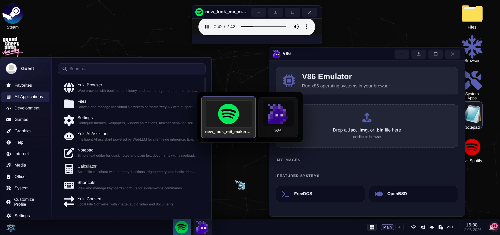
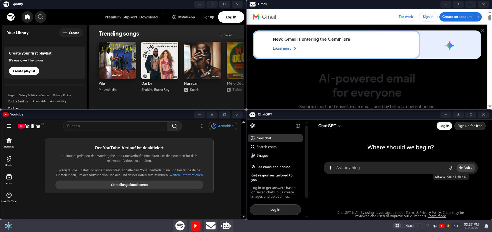

# Yuki OS - Browser Desktop Environment

<div align="center">

[](https://github.com/Reeyuki/yukios)
[](https://github.com/Reeyuki/yukios)
[](LICENSE)
[](https://discord.gg/uFuGfseB9Z)

**Try it now:** [yukios.pages.dev](https://yukios.pages.dev) · [yukios.vercel.app](https://yukios.vercel.app) ·
[yukios.netlify.app](https://yukios.netlify.app)

</div>

> A browser-based desktop environment running in a single web page, combining windowed multitasking, persistent storage,
> emulators, tools, and a large collection of applications and games.

Yuki OS turns a browser tab into a working desktop-style space with draggable windows, multitasking, file handling,
emulators, productivity tools, and interactive apps. Everything runs locally in the browser with persistent storage and
session state.

It supports running Flash content, DOS programs, console emulation, WebAssembly apps, and standard web applications side
by side.

It's built entirely in vanilla JS (TypeScript in core modules) with some libraries, of course!.
  
  
  


---

# ✨ Desktop Experience

- Draggable, resizable, minimizable, maximizable windows
- Window snapping (half screen, quarter screen, fullscreen)
- Multiple workspaces with independent layouts
- Window switching and focus cycling (Alt+Q)
- Live taskbar previews
- Window context menus (snap, move, pin, workspace transfer)
- Taskbar positioned on any edge of the screen
- System tray with background-running apps
- Tray controls and quick actions
- Global command palette (Ctrl+K / F1)
- Desktop shortcuts with drag-and-drop support

---

# 🧭 Navigation & UI

- Taskbar with pinned and running apps
- Start menu for launching and managing apps
- App search and quick switching
- Desktop icon system with persistent shortcuts
- Notification center with grouped messages
- Do Not Disturb mode
- Notification positioning controls
- Context menus across desktop and apps
- Animated UI with adaptive transparency effects

---

# 📁 Files & Storage

- Persistent browser storage using IndexedDB
- File explorer with thumbnails and previews
- Drag-and-drop file operations from host OS
- Create, move, rename, delete, and organize files
- Archive support: `.zip`, `.gz`, `.tar`, `.tar.gz`, `.tgz`, `.tar.xz`, `.7z`, `.bz2`, `.tar.bz2`, `.xz`, `.rar`;
  Create: `.zip`, `.7z`, `.tar`, `.tar.gz`, `.tar.bz2`, `.gz`, `.bz2`; Password-protected ZIP support (creation and
  extraction)

- Bulk file actions, download file support
- File-based actions like setting wallpapers and conversions

---

# 📦 Applications

- 80 built-in applications
- Web apps, utilities, tools, editors, and system apps
- App registry with metadata and launch handling
- Website and external app shortcuts via App Creator
- Sandboxed iframe-based apps
- Direct launch via URL parameters (`?app=` and `?game=`)

---

# 🎮 Emulation & Runtime Support

- Flash content support via Ruffle
- DOS applications via JS-DOS
- Full x86 environments via V86
- Nintendo 3DS emulation via Azahar
- Multi-system game emulation (GBA, SNES, NDS, PSP, Sega, etc.)
- WebAssembly runtime support
- WebGL and HTML5 game support

---

# ⚙️ System Features

- Cross-app event communication
- Notification system with app icons and actions
- Per-app audio mixer with live volume display in sliders
- Achievement tracking and usage milestones
- Setup flow for first-time configuration
- Theme system with 40 presets and custom theme support, light/dark and transparency modes
- Wallpaper customization with animated wallpaper and Vanta.js support
- Calendar and date utilities
- PWA install and offline caching support
- Single-file deployment build option

---

# 💾 Persistence

- Session persistence for windows and workspaces
- User profiles with settings and personalization
- Backup and restore of system state
- BrowserFS backed virtual filesystem

---

# 🧠 Core Runtime

- Window lifecycle handling (create, move, resize, close)
- File system handling for persistent storage
- Notification handling and state
- Event-based communication between apps
- Central app launcher and registry
- Desktop rendering and taskbar management

# 📦 Built-in Applications

## 🧠 Productivity & Development

- Explorer
- Terminal
- Notepad
- Markdown Editor
- Yuki Code
- VS Code
- Settings
- Task Manager
- Installed Apps
- Calculator
- About
- Shortcuts
- Setup Wizard
- What's New
- Achievements
- Profile Customizer
- Yuki AI Assistant
- Storage Editor
- Yuki Convert
- Clipboard Manager
- Categories
- Emoji Selector
- YukiDevTools (IT - TOOLS)
- Weather
- News
- Yuki OS Guide
- Yuki Dev Tools
- Display Performance
- Network Tray

## 🎨 Media & Creative Tools

- Paint
- Mini Paint
- Photopea
- LibreSprite
- Camera App
- Media Viewer
- Office Viewer
- Evil Spotify
- Yuki Blender
- YouTube Utilities
- Rhythms (Cavalier-like audio visualizer)
- Screenshot (page capture, area selection, screen recording)
- Color Picker (screen color sampling with magnified preview)

## 🌐 Browser & Internet

- Yuki Browser
- Steam-like game launcher
- Custom App Creator
- Discord
- Spotify
- Slack
- Gmail
- Outlook
- ChatGPT
- DeepSeek
- Zoom
- Twitter/X
- Instagram
- LinkedIn
- Pinterest
- GitHub
- GitLab
- CodePen
- Replit
- Twitch
- SoundCloud
- Deezer
- Notion
- Figma
- Canva
- Google Docs
- ProtonMail
- Yahoo Mail
- kiwiIRC
- GeForce Now
- Scramjet Proxy
- Torrent Client
- WebTorrent

## 🎮 Games & Emulation Tools

- Yuki Emulator(EmulatorJS)
- Ruffle (Flash)
- JsDos (DOS)
- Virtual 86 (x86)
- Azahar (3DS Emulator)

---

# 🔌 Extensibility

- Apps can register tray icons and background behavior
- Apps can communicate through shared events
- External web apps can be launched as windows
- Apps can persist state through storage APIs

---

# 🛠 Build & Deployment

```bash
pnpm run dev
pnpm run build:dev
pnpm run build
pnpm run preview
```

Single-file build output is supported for easy deployment.

---

# 🤝 Contributing

We welcome contributions! Whether you want to add a new app, fix a bug, or improve documentation, we'd love your help.

For detailed information on:

- Creating new applications
- Using the OS API
- Styling guidelines
- Code quality standards
- Build and deployment processes

See the [Development Guide](DEVELOPMENT.md).

---

# 🛠 Tech Stack

- Vite
- viteSingleFile
- BrowserFS
- IndexedDB
- interactjs
- Ruffle
- EmulatorJS
- Monaco Editor
- Three.js
- PDF.js
- JSZip
- fflate
- archive-wasm
- 7z-wasm
- Handsontable
- Mammoth.js
- Font Awesome
- Emoji Mart
- Vanta.js
- Scramjet/BareMux/epoxy-transport
- WebTorrent

---

# 🎮 Content Support

- Web apps and tools
- WebAssembly applications
- HTML5 and WebGL games
- Flash applications
- DOS software
- Emulator ROMs
- Media and document formats
- Archive files and compressed formats
