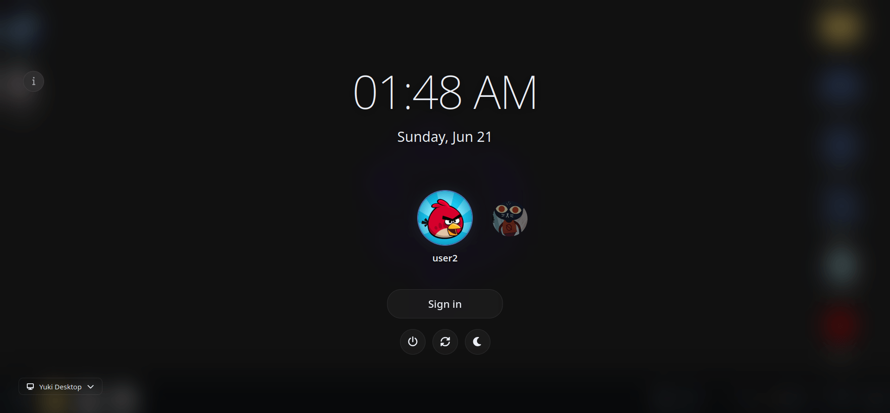

# Yuki OS - Browser Desktop Environment

<div align="center">

[](https://github.com/Reeyuki/yukios)
[](https://github.com/Reeyuki/yukios)
[](LICENSE)
[](https://discord.gg/uFuGfseB9Z)

**Try it now:** [yukios.pages.dev](https://yukios.pages.dev) · [yukios.vercel.app](https://yukios.vercel.app) ·
[yukios.netlify.app](https://yukios.netlify.app)

</div>

> A browser-based desktop environment running in a single web page, combining windowed multitasking, persistent storage,
> emulators, tools, and a large collection of applications and games.

Yuki OS turns a browser tab into a working desktop-style space with draggable windows, multitasking, file handling,
emulators, productivity tools, and interactive apps. Everything runs locally in the browser with persistent storage and
session state.

It supports running Flash content, DOS programs, console emulation, WebAssembly apps, and standard web applications side
by side.

It's built entirely in vanilla JS/TypeScript (with some libraries, of course!) 
  
  
  


---

# ✨ Desktop Experience

- Draggable, resizable, minimizable, maximizable windows
- Window snapping (half screen, quarter screen, fullscreen)
- Multiple workspaces with independent layouts
- Window switching and focus cycling (with alt+Q)
- Live taskbar peeking support on hover
- Window context menus (snap, move, pin, workspace transfer)
- Window header menus for quick actions
- Window icons in title bar
- Taskbar positioned on any edge of the screen
- Taskbar drag to reorder and click to minimize/restore
- System tray with background-running apps
- Tray controls and quick actions
- Desktop shortcuts with drag-and-drop support
- Desktop stretch scroll prevention toggle
- Alt+Right-Click window resize
- Window animation system with 35+ effects
- Cursor launch effect like in kde plasma
- Automatically saves and restores open apps, window positions and sizes, workspace assignments, scroll positions,
  window states (minimized, fullscreen, snapped), focus order

---

# 🧭 Navigation & UI

- Taskbar with pinned and running apps
- Start menu for launching and managing apps with keyboard navigation
- Start menu alphabetical grouping with section headers
- Start menu keybinds (Space, Tab, Ctrl)
- App search and quick switching
- Desktop icon system with persistent shortcuts and image thumbnails
- Notification center with grouped messages
- Do Not Disturb mode
- Notification positioning controls
- Context menus across desktop and apps
- Animated UI with adaptive transparency effects
- Keyboard shortcuts app for global hotkeys

**Key Global Shortcuts:**

- Ctrl+K / Ctrl+P / F1 - Open command palette
- Ctrl+D - Show/hide desktop
- Alt+Q - Cycle through windows
- Ctrl+Shift+S - Full screenshot
- Ctrl+Alt+S - Area screenshot
- Ctrl+Shift+R - Screen recording

**Command Palette Features:**

- Search apps, files, and system commands
- Quick actions: wallpaper, themes, DND, mute, workspace switching
- Terminal commands (prefix with `>`)
- Built-in calculator and unit converter
- Screenshot and screen recording controls

---

# 📁 Files & Storage

- Persistent browser storage using IndexedDB
- File explorer with thumbnails and previews
- Drag-and-drop file operations from host OS
- Context menu to open images in Paint
- File properties dialog with rename support
- Create, move, rename, delete, and organize files
- Drag-select multiple files with selection box
- Trash bin with restore functionality
- Archive support: `.zip`, `.gz`, `.tar`, `.tar.gz`, `.tgz`, `.tar.xz`, `.7z`, `.bz2`, `.tar.bz2`, `.xz`, `.rar`
  (create: `.zip`, `.7z`, `.tar`, `.tar.gz`, `.tar.bz2`, `.gz`, `.bz2` with password-protected ZIP support)

- Bulk file actions, download file support
- File-based actions like setting wallpapers and conversions
- HTML file rendering support
- Dynamic favicon updates based on current app

---

# 📦 Applications

- 80 built-in applications
- Web apps, utilities, tools, editors, and system apps
- Website and external app shortcuts via App Creator
- Direct launch via URL parameters (`?app=` and `?game=`)

---

# 🎮 Emulation & Runtime Support

- DOS applications via JS-DOS with file upload support
- x86 environments via V86
- Nintendo 3DS emulation via Azahar
- Multi-system game emulation (GBA, SNES, NDS, PSP, Sega, etc.)

---

# ⚙️ System Features

- Cross-app event communication
- Notification system with app icons and actions
- Per-app audio mixer with live volume display in sliders
- Achievement tracking and usage milestones
- Setup flow for first-time configuration
- Theme system with 40 presets and custom theme support, light/dark and transparency modes
- Wallpaper customization with animated wallpaper and Vanta.js support
- PWA install and offline caching support
- User accounts with multi-profile support
- Lock screen and session management
- Power management modes (Turbo, Balanced, Quality)
- Custom cursor support (with miku by default)
- Import/export system for backup and migration
- Transparent UI toggle
- Audio mixer with live visualizer

---

# 💾 Persistence

- Session persistence for windows and workspaces
- User profiles with settings and personalization
- Backup and restore of system state

# 📦 Built-in Applications

## 🧠 Productivity & Development

- Explorer
- Terminal (Unix-like commands with tab completion, history, pipelines, and glob patterns)
- Notepad
- Markdown Editor
- Yuki Code
- VS Code
- Settings
- Task Manager
- Installed Apps
- Calculator
- About
- Shortcuts
- Setup Wizard
- What's New
- Achievements
- Profile Customizer
- Yuki AI Assistant
- Storage Editor
- Yuki Convert
- Clipboard Manager
- Categories
- Emoji Selector
- YukiDevTools (IT - TOOLS)
- Weather
- News
- Yuki OS Guide
- Display Performance
- Network Tray
- Maps
- Virtual Machine Manager
- Accounts

## 🎨 Media & Creative Tools

- Paint
- Mini Paint
- Photopea
- LibreSprite
- Pixlr
- Camera App
- Media Viewer
- Office Viewer
- Evil Spotify
- Yuki Blender
- YouTube Utilities
- Rhythms (Cavalier-like audio visualizer)
- Screenshot (page capture, area selection, screen recording)
- Color Picker (screen color sampling with magnified preview)

## 🌐 Browser & Internet

- Yuki Browser
- Steam-like game launcher
- Custom App Creator
- Discord
- Spotify
- Slack
- TikTok
- Gmail
- Outlook
- ChatGPT
- Grok
- DeepSeek
- Zoom
- Twitter/X
- Instagram
- Pinterest
- GitHub
- GitLab
- CodePen
- Replit
- Twitch
- SoundCloud
- Deezer
- Notion
- Figma
- Canva
- Google Docs
- ProtonMail
- Yahoo Mail
- kiwiIRC
- GeForce Now
- Scramjet Browser
- Torrent Client
- WebTorrent And more

## 🎮 Games & Emulation Tools

- Yuki Emulator(EmulatorJS)
- Ruffle (Flash)
- JsDos (DOS)
- Virtual 86 (x86)
- Azahar (3DS Emulator)

---

# 🔌 Extensibility

Extensible app platform with background apps, shared events, persistent state, and windowed web app integration.

---

# 🛠 Build & Deployment

```bash
pnpm run dev
pnpm run build:dev
pnpm run build
pnpm run preview
```

Single-file bundling for easy deployment.

---

# 🤝 Contributing

We welcome contributions! Whether you want to add a new app, fix a bug, or improve documentation, we'd love your help.

For detailed information on:

- Creating new applications
- Using the OS API
- Styling guidelines
- Code quality standards
- Build and deployment processes

See the [Development Guide](DEVELOPMENT.md).

---

# 🛠 Tech Stack

- BrowserFS
- interactjs
- Ruffle
- EmulatorJS
- Monaco Editor
- Three.js
- PDF.js
- JSZip
- fflate
- archive-wasm
- 7z-wasm
- Handsontable
- Mammoth.js
- Font Awesome
- Emoji Mart
- Vanta.js
- Scramjet/BareMux/epoxy-transport
- WebTorrent

# Tooling stack

- Vite
- Typescript
- Eslint
- Prettier
- viteSingleFile

---

# 🎮 Content Support

- Web apps and tools
- WebAssembly applications
- HTML5 and WebGL games
- Flash applications
- DOS software
- Emulator ROMs
- Media and document formats
- Archive files and compressed formats
